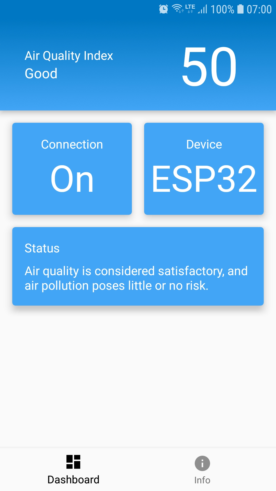
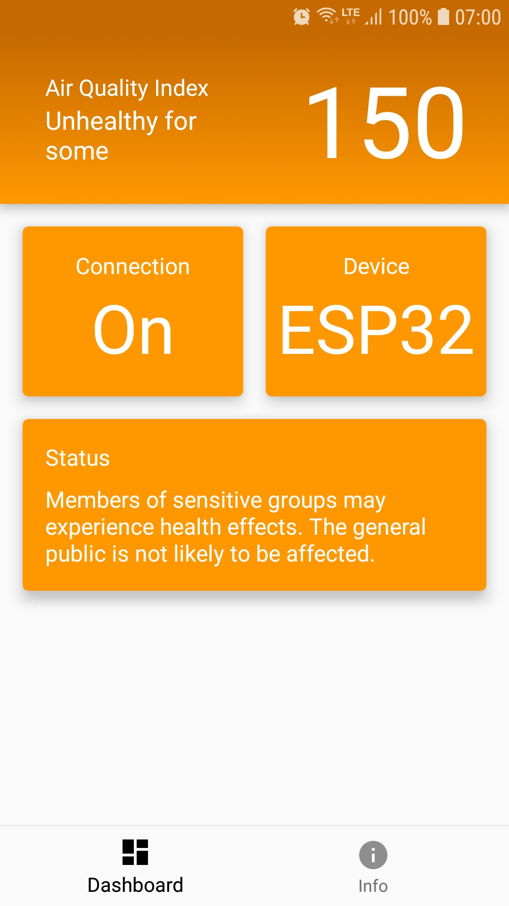
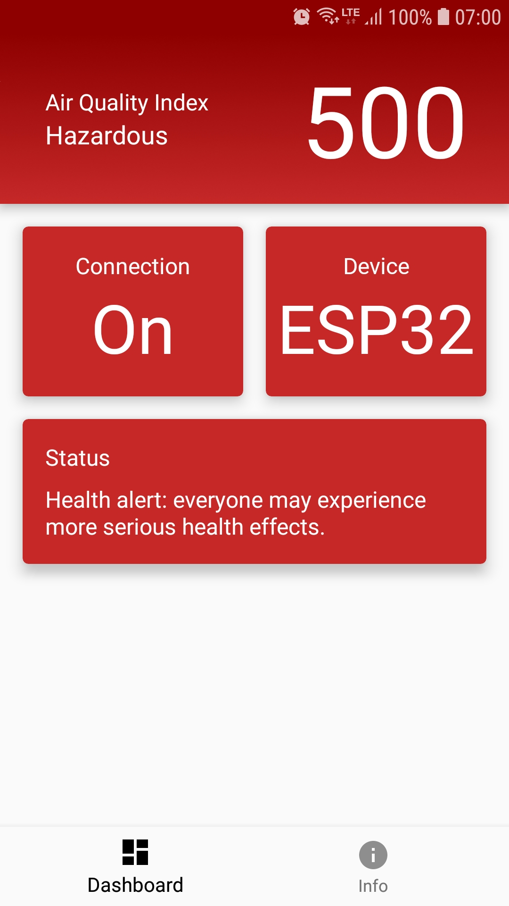
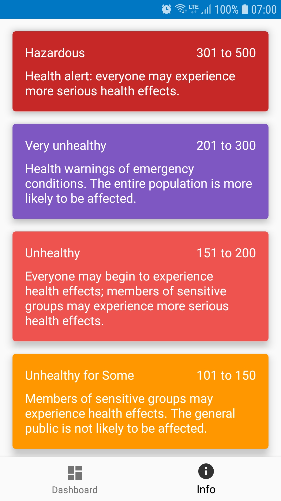

# PersonalRoomCare
People are spending a lot of time in their rooms nowadays. It is crucial to have good air quality in the room. With the Personal Room Care project we will measure and visualise the air quality in the room. Also, based on the measurements we will show a recommendation about air quality and whether actions are needed to improve the air quality.

This is project is done for the course IN4398 Advanced Practical I.o.T. and Seminar at Delft University of Technology.

# Results
We developed an Android app the visualised the air quality of a room. The data is obtained using a Bluetooth connection with a microcontroller. This microcontroller has an MQ 135 air quality sensor. 

   
